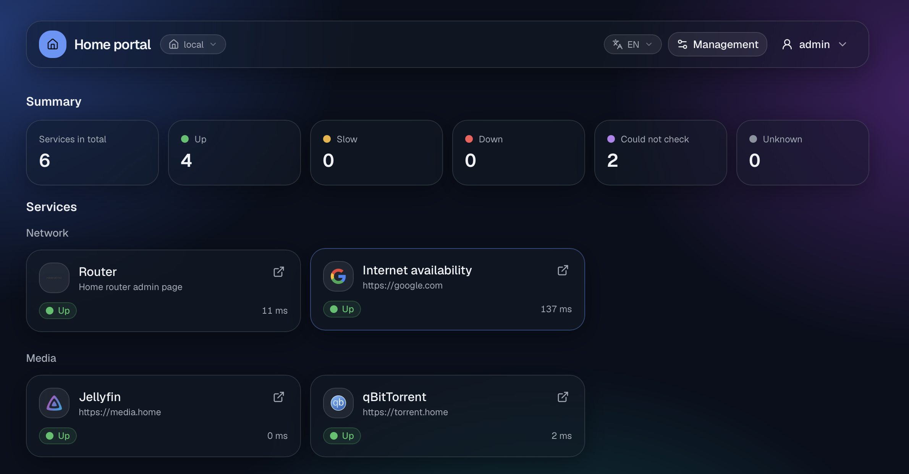
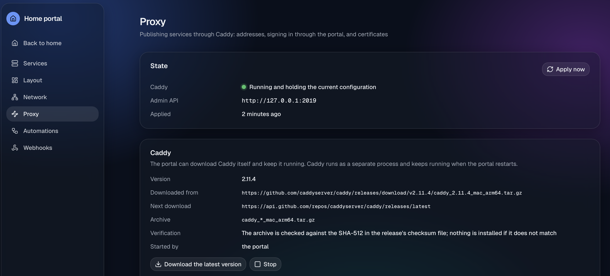
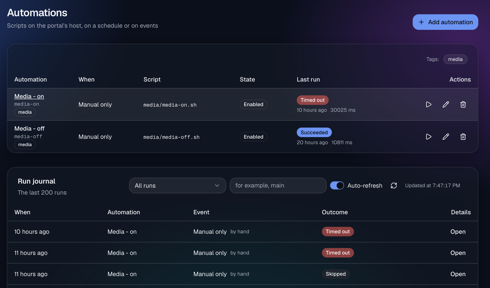
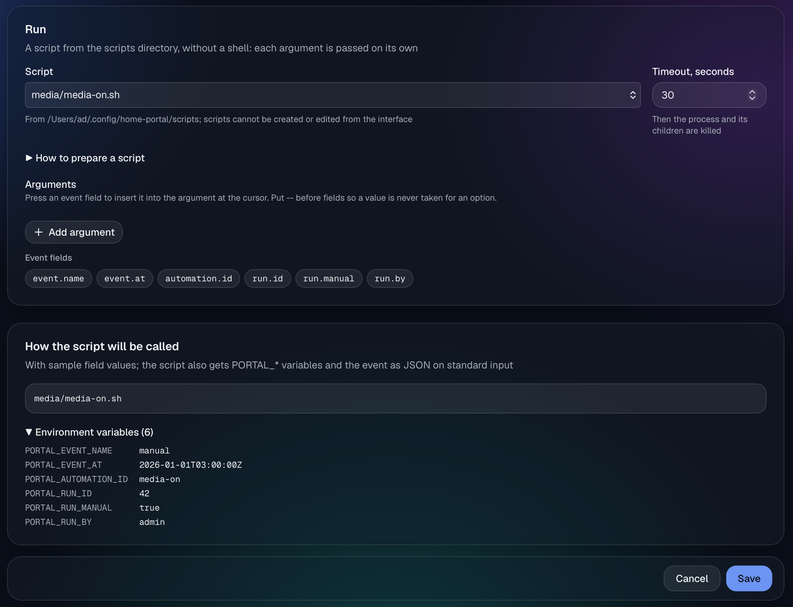
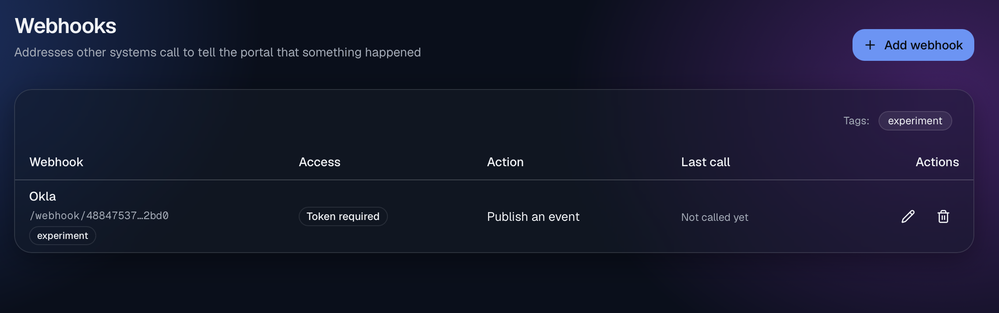
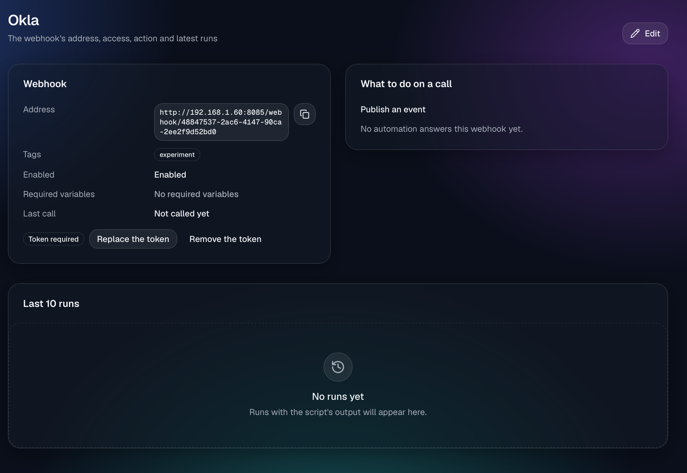

# home-portal

A self-hosted start page for a home network. It shows whether your services are up and how they
have behaved over the last 30 days, and lets you manage them from the browser — all from one small
program with no database.

- **[Services and their status](docs/features/services-and-status.md)** — HTTP, TCP and ICMP checks,
  30 days of uptime and latency, a plain-words diagnosis when something is down, and icons.
- **[A home page you arrange](docs/features/home-page.md)** — sections and widgets (service tiles,
  status summary, host metrics, weather, calendar), laid out in the browser.
- **[Environments](docs/features/environments.md)** — the right address at home, over VPN or from the
  internet, and a public page with only what you mark public.
- **[Reverse proxy](docs/features/reverse-proxy.md)** — publish services under their own names with
  HTTPS through Caddy, which the portal downloads and runs, optionally behind its sign-in.
- **[Local DNS](docs/features/local-dns.md)** — names like `jellyfin.home` that resolve on your
  networks without editing your router's records.
- **[Users, groups and sign-in](docs/features/users-and-sign-in.md)** — who may sign in, and groups with
  rights per module and function; the built-in `admin` group may do everything.
- **[Automations](docs/features/automations.md)**, **[webhooks](docs/features/webhooks.md)** and
  **[workflows](docs/features/workflows.md)** — run your own scripts on a schedule, on portal events or
  when another system calls, and chain steps on a canvas you can watch while they run.
- **[Notifications](docs/features/notifications.md)** — Telegram messages when a service changes state.
- **[Scripts](docs/features/scripts.md)**, **[network settings](docs/features/network-and-restart.md)**
  and **[modules](docs/features/modules.md)** — where your scripts live, the portal's own address, and
  switching the optional parts on and off.
- **[macOS permissions](docs/features/host-permissions.md)** — the portal asks for the local network, disks,
  folders and Automation at start, so your scripts never wait on a prompt.

The settings are plain TOML files that the interface edits in place, keeping your comments.

- **Install:** [docs/INSTALL.md](docs/INSTALL.md) — packages for macOS, Debian/Ubuntu and RHEL/Fedora,
  and archives.
- **Configure:** [docs/CONFIGURATION.md](docs/CONFIGURATION.md) — how the files fit together.
- **All features:** [docs/features/](docs/features/README.md).
- **Develop:** [docs/DEVELOPMENT.md](docs/DEVELOPMENT.md) — building it yourself and working on the code.

## Screenshots

Main

Proxy

Automations

Automations run

Webhooks

Webhook details

## License

[Apache License 2.0](LICENSE).
